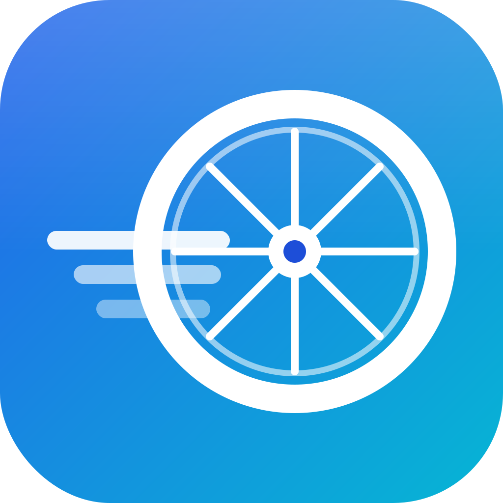

<div align="center">



# Gotta Bike Fast

**A Zwift-style indoor cycling game** — ride real GPX courses in 3D, race
friends with live ghosts, and pair your real BLE power meter, heart-rate
strap, and smart trainer.

[](https://github.com/vincentdavis/gotta-bike-fast/actions/workflows/build.yml)
[](https://github.com/vincentdavis/gotta-bike-fast/releases/latest)


> ⚠️ **Early alpha.** Builds are unsigned/un-notarized and the backends are
> still moving. Expect rough edges.

</div>

---

## Download & play

Grab the latest installer from the **[Releases page](https://github.com/vincentdavis/gotta-bike-fast/releases/latest)**:

| Platform | File | Notes |
|---|---|---|
| **macOS** (Apple Silicon) | `GottaBikeFast.dmg` | Open the `.dmg`, drag to Applications. First launch: **right-click → Open** (unsigned). |
| **Windows** | `GottaBikeFast-Setup.exe` | Per-user installer. SmartScreen may warn (unsigned) — *More info → Run anyway*. |
| **Windows (portable)** | `GottaBikeFast-windows-portable.zip` | Unzip and run `GottaBikeFast.exe`. |

Each package **bundles the BLE sensor bridge and launches it automatically** —
no Python or extra setup needed to use sensors.

> The client talks to backend servers for accounts, courses, and live
> multiplayer. Out of the box it points at a hosted **ALPHA_1** environment;
> switch to **LOCAL** (or custom URLs) in-game under **System → Dev menu**.

## Features

- 🚵 **3D rides on real routes** — upload a GPX and the route becomes a course
  with elevation-following terrain, roadside scenery, and a live topo minimap.
- 🏁 **Multiplayer races** — create a game, share a 6-character join code,
  gather in a lobby, count down from the start pen, then race with other
  riders shown as named ghosts on a live leaderboard. Solo mode too.
- ⚙️ **Real physics** — speed is computed from power, rider mass, CdA, rolling
  resistance, gradient, and drafting. Pick a rider and a garage loadout
  (bike / wheels / tires) that actually changes how you ride.
- 📡 **BLE sensors** — pair a power meter, heart-rate strap, and cadence
  sensor; control a **smart trainer (FTMS)** so resistance follows the road
  (SIM) or holds a target wattage (ERG). **Keyboard control always works** as
  the default and the fallback.
- 📈 **Ride history** — rides are recorded and exportable to **`.fit`** for
  Strava/Garmin/etc.

## Controls

| Key | Action |
|---|---|
| `↑` / `↓` | Power up / down (when not using a sensor) |
| `←` / `→` | Move across the road |
| `T` | Turn around |
| `Space` | Coast (cut power) |
| `Esc` | Finish the ride |

With a paired power meter the measured watts drive the ride; the keyboard
ramp takes over automatically if you switch sources or a sensor drops out.

## Sensors (Bluetooth)

A small Python [`bleak`](https://github.com/hbldh/bleak) **bridge**
(`bridge/`) does the cross-platform BLE work and forwards readings to the
game over a localhost WebSocket. Released builds bundle a frozen copy and the
game spawns it on demand. In the editor, run it yourself:

```bash
cd bridge && uv run gbf-bridge
```

Then in-game: **Ride → Sensors → Sensor → Scan → Connect**. See
[`bridge/README.md`](bridge/README.md) for the supported GATT profiles
(Cycling Power, Heart Rate, CSC, FTMS) and the wire protocol.

## Architecture

```
┌─────────────────────────┐     WebSocket      ┌──────────────────────┐
│  Godot client (this repo)│ ◀───────────────▶ │  bleak bridge        │
│  GDScript · 4.6.3        │  ws://127.0.0.1    │  (bundled, Python)   │  ◀─▶ BLE sensors
└───────────┬─────────────┘                    └──────────────────────┘
            │ REST + WS
   ┌────────┴─────────┐
   ▼                  ▼
┌─────────────┐  ┌──────────────────────────────┐
│ FastAPI     │  │ Django                        │
│ live game   │  │ accounts · riders · garage ·  │
│ state (WS)  │  │ GPX→courses · ride history    │
└─────────────┘  └──────────────────────────────┘
        (backends live in separate repositories)
```

## Build from source

Prerequisites: **Godot 4.6.3** and matching export templates; **[uv](https://github.com/astral-sh/uv)** for the bridge.

```bash
# open / run the client
git clone https://github.com/vincentdavis/gotta-bike-fast.git
# ...open the folder in the Godot editor, or run headless:
"$HOME/Applications/Godot.app/Contents/MacOS/Godot" --headless --import .

# sensor bridge
cd bridge && uv run gbf-bridge          # run it
uv run pytest                           # tests (no hardware needed)
```

- **Official installers come from CI** ([`.github/workflows/build.yml`](.github/workflows/build.yml)),
  which freezes the bridge, bundles it, thins macOS to arm64, and publishes a
  release on every push to `main`.
- For manual local exports see [`BUILD.md`](BUILD.md); for project conventions
  see [`CLAUDE.md`](CLAUDE.md).

## Repository layout

| Path | What |
|---|---|
| `scenes/`, `scripts/` | Godot scenes and GDScript (UI, world, networking) |
| `bridge/` | Python BLE sensor bridge (`uv`-managed) |
| `packaging/` | Windows Inno Setup installer script |
| `branding/` | App icon (“Speed Wheel”) source + exports |
| `.github/workflows/` | CI: build, package, and release |

## License

No open-source license is granted yet — all rights reserved by the author.
If you'd like to use the code, please open an issue.
